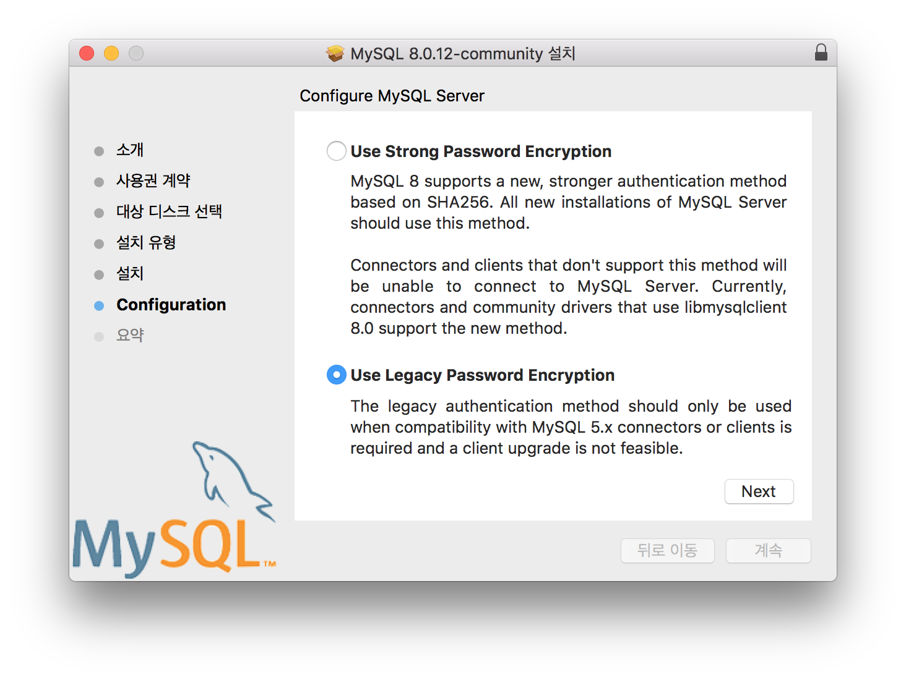
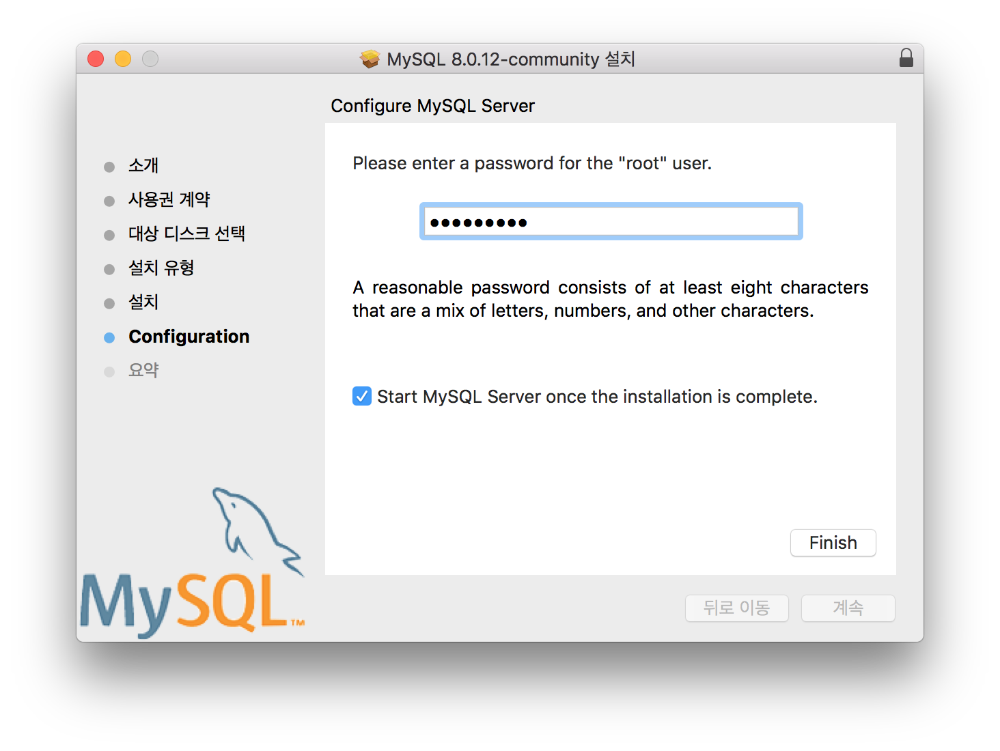
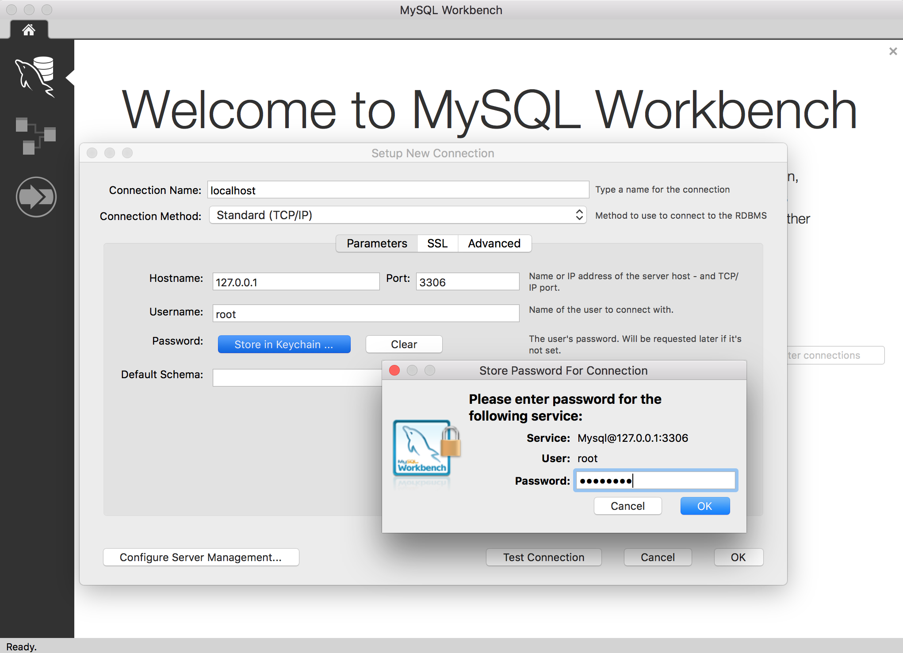
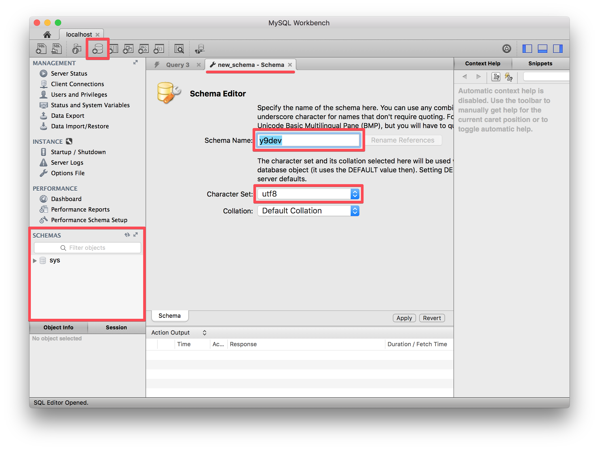
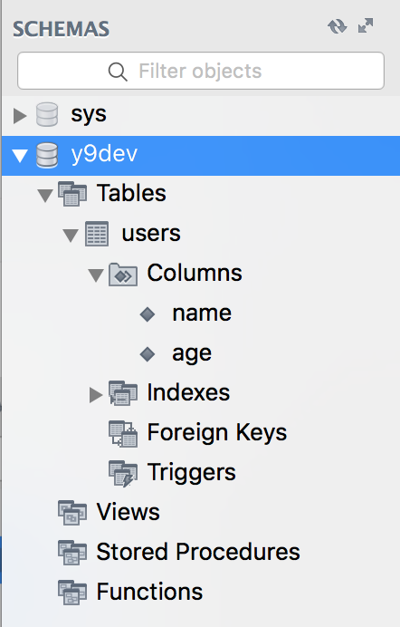

# 설치 구성

#### JavaScript Runtime

- [Node.js](https://nodejs.org) - 플랫폼(OS) 설치 필요
- [Yarn](https://yarnpkg.com)

#### Database

- [Sequelize.js](http://docs.sequelizejs.com) :: "[Promise](https://developer.mozilla.org/ko/docs/Web/JavaScript/Reference/Global_Objects/Promise)를 기반으로 하는 [<abbr title="객체 관계 매핑(Object-Relational Mapping">ORM</abbr>](http://www.incodom.kr/ORM)"
- [MySQL Community Server](https://dev.mysql.com/downloads/mysql) - 플랫폼(OS) 설치 필요
- [MySQL Workbench](https://dev.mysql.com/downloads/workbench/) - 플랫폼(OS) 설치 필요

#### Server Framework

- [Express.js](https://expressjs.com)
- [Express.js (번역)](http://expressjs.com/ko/)

#### Client Framework

- [Vue.js](https://vuejs.org)
- [Vue.js (번역)](https://kr.vuejs.org)

#### Server + Client Public Tools

- [Pug](https://pugjs.org) :: 템플릿 엔진
- [Sass](http://sass-lang.com) :: CSS 프리 프로세서

<br>

# MySQL

### MySQL 설치 및 설정

#### 커뮤니티 서버 설치

> Use Legacy Password Encryption 선택 후, NEXT 버튼 클릭



> "root" 사용자 권한으로 사용할 패스워드 입력 (문자, 숫자, 특수문자 조합 8자리)



#### 워크벤치 설치 및 설정

> 워크벤치 설치 후, 구동한 다음 + 버튼을 눌러 커넥션(예: `localhost`) 생성<br>
> Connection Name: localhost 입력 후, Password 설정 ➟ OK



> 생성된 localhost를 클릭 후, 스키마(Schema) 생성



> 생성된 스키마(Schema)

<br>

데이터베이스 계층 구조 (테이블 구조와 유사)

```sh
Database(Schema)
  └─ Tables
      └─ Rows
          └─ Columns
```

- 데이터베이스(스키마)는 "하나의 프로젝트"
- 테이블은 "프로젝트 안에서 저장할 데이터들의 묶음"

<br>

# 프로젝트 설정

### 프로젝트 초기화

프로젝트 디렉토리 생성 후, 디렉토리 내부에 `package.json` 파일 생성

```sh
$ yarn init
```

### Nodemon 로컬 설치(개발용)

[Nodemon](https://www.npmjs.com/package/nodemon)은 파일이 변경 수정되면, 자동으로 애플리케이션 다시 시작하도록 도와주는 도구

```sh
$ yarn add -D nodemon
```

`package.json` 파일에 NPM Scripts **start** 명령 코드 추가

```json
"scripts": {
  "start": "nodemon app"
}
```

### sequelize, mysql2 패키지 로컬 설치

ORM, Dialect(방언) 패키지 설치

```sh
$ yarn add sequelize mysql2
```

### 시퀄라이즈 명령어 인터페이스 전역 설치

`sequelize` 명령을 CLI에서 바로 사용하기 위함

```sh
$ yarn global add sequalize-cli
```

### 시퀄라이즈 초기화

```sh
$ sequelize init

# config/config.json, model/index.js, migrations, seeders 생성

Sequelize CLI [Node: 8.11.1, CLI: 5.1.0, ORM: 4.39.0]

Created "config/config.json"
Successfully created models folder at "/Users/yamoo9/Projects/y9-dev/models".
Successfully created migrations folder at "/Users/yamoo9/Projects/y9-dev/migrations".
Successfully created seeders folder at "/Users/yamoo9/Projects/y9-dev/seeders".
```

*models/index.js* 코드

```js
const path = require('path');

// sequelize 패키지 로드 (클래스)
const Sequelize = require('sequelize');

// 개발(기본 값), 테스트, 배포 설정 하나의 값을 env에 설정
const env = process.env.NODE_ENV || 'development';

// config.json 설정 중 env 값에 일치하는 데이터를 config에 설정
const config = require('../config/config.json')[env];

// 데이터베이스, 사용자이름, 비밀번호를 설정
const { database, username, password } = config;

// Sequelize 클래스를 통해 인스턴스 생성 (데이터베이스, 사용자이름, 비밀번호, 환경설정)
const sequelize = new Sequelize(databse, username, password, config);

// db 객체에 클래스, 인스턴스를 속성으로 설정
const db = {
  Sequelize,
  sequelize
};

// db 객체(모듈) 내보내기
module.exports = db;
```

### 커넥션 이름/비밀번호 설정

MySQL 커넥션 이름 및 비밀번호를 입력합니다.

*config/config.json*

```json
"development": {
  "username": "root",
  "password": "MySQL 커넥션 비밀번호",
  "database": "MySQL 커넥션 이름",
  "host": "127.0.0.1",
  "dialect": "mysql"
},
```

### 운영 보안 (`operatorsAliases`) 설정

보다 나은 보안을 위해 Sequelize.Op 문자열 별칭(alias) 없이 사용하는 것이 좋습니다. [#참고](http://docs.sequelizejs.com/manual/tutorial/querying.html#operators-aliases)

*config/config.json*

```json
"development": {
  "username": "root",
  "password": "MySQL 커넥션 비밀번호",
  "database": "MySQL 커넥션 이름",
  "host": "127.0.0.1",
  "dialect": "mysql",
  "operatorsAliases": false
},
```

### Database 생성

데이터베이스 생성 명령

```sh
# 환경 설정(config.json)에 기술된 데이터베이스 생성
$ sequelize db:create

# 커넥션(예: localhost) 생성됨.

Sequelize CLI [Node: 8.11.1, CLI: 5.1.0, ORM: 4.39.0]

Loaded configuration file "config/config.json".
Using environment "development".
Database localhost created.
```

### 웹 프레임워크 및 의존 개발 패키지 설치

아래 나열된 개발 패키지를 모두 설치 [#참고](http://expressjs.com/ko/resources/middleware.html)

- [express](https://www.npmjs.com/package/express) - 웹 프레임워크
- [express-session](https://www.npmjs.com/package/express-session) - 익스프레스용 세션 미들웨어
- [cookie-parser](https://www.npmjs.com/package/cookie-parser) - 쿠키 해석 미들웨어
- [morgan](https://www.npmjs.com/package/morgan) - HTTP 요청 로거(logger) 미들웨어
- [connect-flash](https://www.npmjs.com/package/connect-flash) - 메시지를 저장하는 1회성 세션 미들웨어
- [pug](https://www.npmjs.com/package/pug) - Pug 미들웨어
- [node-sass-middleware](https://github.com/sass/node-sass-middleware) - Sass 미들웨어

```sh
$ yarn add express express-session cookie-parser morgan connect-flash pug node-sass-middleware
```

### Express 프레임워크 구성

프로젝트 루트 디렉토리에 `app.js`를 생성

*app.js*

```js
const path = require('path');

// 미들웨어 패키지 로드
const cookieParser = require('cookie-parser');
const session = require('express-session');
const morgan = require('morgan');
const flash = require('connect-flash');
const pug = require('pug');
const sass = require('node-sass-middleware');

// Express 프레임워크 패키지 로드
const express = require('express');
const app = express();
const port = process.env.PORT || 9090;

// 템플릿 엔젠 & views, 포트 설정
app.set('views', path.join(__dirname, 'views'));
app.set('view engine', 'pug');
app.set('port', port);

// Sass 설정
// 참고: https://github.com/sass/node-sass-middleware#express-example
app.use(sass({
  src: path.join(__dirname, 'sass'),
  dest: path.join(__dirname, 'public'),
  debug: true,
  outputStyle: 'compressed',
  prefix: '', // <link rel="stylesheets" href="{prefix}/style.css">
}));
app.use(express.static(path.join(__dirname, 'public')));

app.use(morgan('dev'));
app.use(express.json());
app.use(express.urlencoded({extended: false}));
app.use(cookieParser('보안 비밀번호'));
app.use(session({
  resave: false,
  saveUninitialized: false,
  secret: '보안 비밀번호',
  cookie: {
    httpOnly: true,
    secure: false,
  }
}));
app.use(flash());


app.listen(port, () => {
  console.log(`http://localhost:${port}로 서버가 구동 되었습니다.`);
});
```

### [dotenv](https://www.npmjs.com/package/dotenv) 설정

`.env` 파일에 보안 정보를 모아 저장한 후, 패키지를 통해 `process.env`에 속성으로 설정 처리

#### dotenv 패키지 설치

```sh
$ yarn add dotenv
```

#### .env 파일 생성

루트 디렉토리에 `.env` 파일을 생성한 후 보안 처리할 비밀번호를 `키=값` 형식으로 작성 후 저장<br>
※ 해당 파일을 웹 브라우저를 통해 접근하게 해서는 안됨! (보안 위협)

```sh
COOKIE_SECRET=비밀번호
SESSION_SECRET=비밀번호
PORT=9090
```

#### app.js 파일 수정

```js
// 보안 설정
// 참고: https://www.npmjs.com/package/dotenv#usage
require('dotenv').config();

// dotenv 패키지는 process.env에 .env 파일에 설정된
// 보안 정보를 속성으로 접근할 수 있도록 만들어 줌
const port = process.env.PORT || 8080;

app.use(cookieParser( process.env.COOKIE_SECRET ));
app.use(session({
  secret: process.env.SESSION_SECRET,
}));
```

### 라우터 설정

#### 인덱스 라우터

`routes` 디렉토리를 루트에 생성한 후, `index.js` 파일을 생성

*app.js*

```js
// 라우터 모듈 로드
const indexRouter = require('./routes');

// 라우터 연결
app.use('/', indexRouter);
```

*routes/index.js*

```js
const express = require('express');
const router = express.Router();

// 메인 페이지
router.get('/', (req, res, next) => {
  // Pug 페이지 렌더링
  res.render('main', {
    title: '메인 페이지 타이틀',
    // 로그인 오류 발생 시 1회 플래시 처리
    loginError: req.flash('loginError'),
  });
});

// 페이지가 다수일 경우 아래 라우트 등록
// 예) 프로필, 회원가입 등

module.exports = router;
```

#### views, public 설정

- `views` 디렉토리를 루트에 생성한 후, 각 페이지 별 Pug 파일 생성
- `public` 디렉토리를 루트에 생성한 후, CSS 정적 파일 생성

#### 오류 처리 미들웨어 설정

오류 발생 시, `views/error.pug` 파일 렌더링 처리

```js
// 오류 처리 미들웨어 설정
app.use((req, res, next) => {
  const error = new Error('Not Found');
  error.status = 404;
  next(error);
});

app.use((error, req, res) => {
  res.locals.message = error.message;
  res.locals.error = req.app.get('env') === 'development' ? error : {};
  res.status(error.status || 500);
  res.render('error');
});
```
